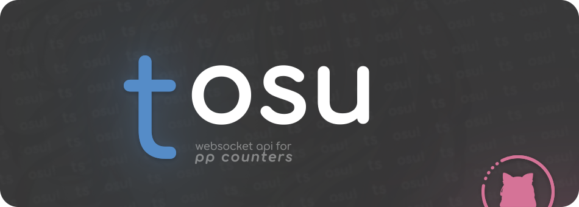

<p align="center">
  <a href="https://github.com/tosuapp/tosu/blob/master/LICENSE" target="_blank"></a>
  
  
  <a href="https://twitter.com/kotrik0" target="_blank"></a>
</p>


<h1 align="center">Welcome to tosu 👋</h1>
<div align="center">
  
</div>

<br>

<p align="center">
  
  
  
  
</p>

<div  align="center">
  <a href="https://boosty.to/kotrik/donate"></a><a href="https://kotrik0.gumroad.com/l/tosuapp"></a><br>
  <a href="https://github.com/tosuapp/tosu/releases/latest"></a>
  <a href="https://discord.gg/WX7BTs8kwh"></a>
  <a href="https://github.com/tosuapp/counters/tree/master/counters"></a>
</div>

<br>

```text
Tosu is a memory reader for osu! that sends data to overlays (aka pp counters) via WebSocket API, with extra features.
```
> [!NOTE]
> Supports stable and osu! lazer. <br> Compatible with _**gosumemory**_ and _**streamCompanion**_ overlays.

<br>

Installation guide
---
1. Download [tosu](https://github.com/tosuapp/tosu/releases/latest)
2. Extract tosu.exe to a `Folder`
3. Run `tosu.exe`
4. Go to [http://127.0.0.1:24050](http://127.0.0.1:24050)
5. Now you in overlays dashboard, in here you can download counters, or tweek settings of tosu
6. Here you can watch showcase of dashboard: [link](https://youtu.be/3eW4TD_zwhM)
8. Have fun!
---

<br>

Features
---
- [x] All _**Gamemodes**_ are supported. Using [rosu-pp](https://github.com/MaxOhn/rosu-pp) for pp calculations
- [x] gosuMemory _**compatible**_ api
- [x] streamCompanion _**compatible**_ api
- [x] Lazer support
- [X] Brand _**new api**_ for websocket
- [x] _**In-game**_ overlay, allow adding multiple overlays (pp counters)
- [x] _**Available**_ websocket data:
  - Settings
  - Gameplay data
  - User ingame data
  - Beatmap data
  - Session _**(Work in progress)**_
  - Multiple graphs for different skill sets _**(aim, speed, etc)**_
    - Extended starrating stats _**(per mode)**_
  - Leaderboards list _**(array)**_
  - Folders paths and Files names
  - Direct paths to files
  - Result screen
  - Tourney data _**(not tested, yet)**_
- [X] LOW CPU USAGE (I actually checked, this thing has a much lower memory recoil than the gosu)
---

<br>

In-game overlay
---
- To enable it, you need to edit `tosu.env`, and turn on `ENABLE_INGAME_OVERLAY=true` (make it equal `true`)
- Tutorial: TBA
---


<br>

API
---
- `/` - List of all counters you have

gosu compatible api
- `/json` - Example of `/ws` response
- `/ws` - [response example](https://github.com/tosuapp/tosu/wiki/v1-websocket-api-response)
- `/Songs/{path}` - Show content of the file, or show list of files for a folder

streamCompanion compatible api
- `/json/sc` - Example of `/tokens` response
- `/tokens` - [response example](https://github.com/tosuapp/tosu/wiki/v1-websocket-api-response)
- `/backgroundImage` - Current beatmap background

v2 _**(tosu own api)**_
- `/json/v2` - Example of `/websocket/v2` response
- `/websocket/v2` - [response example](https://github.com/tosuapp/tosu/wiki/v2-websocket-api-response)
- `/websocket/v2/precise` - [response example](https://github.com/tosuapp/tosu/wiki/v2-precise-websocket-api-response)
- `/files/beatmap/{path}` - same as `/Songs/{path}`
- `/files/beatmap/background` - Background for current beatmap
- `/files/beatmap/audio` - Audio for current beatmap
- `/files/beatmap/file` - .osu file for current beatmap
- `/files/skin/{path}` - similar as `/files/beatmap/{path}`, but for a skin

api
- `/api/calculate/pp` - Calculate pp for beatmap with custom data
  - [Response example](https://github.com/tosuapp/tosu/wiki/api-calculate-pp-response-example)
  - BY DEFAULT IT USES CURRENT BEATMAP (:))
  - All parameters are optional
  - `path` - Path to .osu file. Example: C:/osu/Songs/beatmap/file.osu
  - `lazer` - true or false
  - `mode` - osu = 0, taiko = 1, catch = 2, mania = 3
  - `mods` - Mods id or Array of mods. Example: 64 - DT or [ { acronym: "DT", settings": { speed_change: 1.3 } } ]
  - `acc` - Accuracy % from 0 to 100
  - `nGeki` - Amount of Geki (300g / MAX)
  - `nKatu` - Amount of Katu (100k / 200)
  - `n300` - Amount of 300
  - `n100` - Amount of 100
  - `n50` - Amount of 50
  - `sliderEndHits` - Amount of slider ends hits (lazer only)
  - `smallTickHits` - Amount of slider small ticks hits (lazer only)
  - `largeTickHits` - Amount of slider large ticks hits (lazer only)
  - `nMisses` - Amount of Misses
  - `combo` - combo
  - `passedObjects` - Sum of nGeki, nKatu, n300, n100, n50, nMisses
  - `clockRate` - Map rate number. Example: 1.5 = DT
---


<br />

Support
---
- Give a ⭐️ if this project helped you!
- If you need help setting up this program or have any suggestions/comissions, feel free to go to the [discord](https://discord.gg/WX7BTs8kwh) channel above in the `🔵 tosu` section
---

<br/>

Linux notice
---
- osu! stable build tested on [osu-winello script](https://github.com/NelloKudo/osu-winello/tree/main) with arch linux 2025.03.01 (latest confirmed that all works)
- If you're using custom wine prefix with wine cwd breaking (your cwd is showing windows path instead of full linux one) please set `TOSU_OSU_PATH` in your bash/zsh profile (example `TOSU_OSU_PATH=/home/kotrik/.local/share/osu-wine/osu!`)
- osu! lazer builds tested on AppImage from official osu repository and flatpak image
---

<br/>

Sponsorship & Thank notice
---
| [](https://signpath.io/) | Free code signing on Windows provided by [SignPath.io](https://signpath.io/), certificate by [SignPath Foundation](https://signpath.org/) |
| :----------------------------------------------------------------------------------------------------------------------------: | :--------------------------------------------------------------------------------------: |
| tosu-ingame-overlay | Overlay provided by [storycraft](https://github.com/storycraft) |

<br />

## Maintainers

🐱‍👓 **Mikhail Babynichev**
* _**LEADMF**_
* Website: http://kotrik.ru
* Twitter: [@kotrik0](https://twitter.com/kotrik0)
* Github: [@KotRikD](https://github.com/KotRikD)
<br>

🍒 **Cherry**
* _**Memory guy**_
* Github: [@xxCherry](https://github.com/xxCherry)
<br>

🍥 **storycraft**
* _**baking an ingame-overlay**_
* Website: https://pancake.sh
* Twitter: [@storycraft8814](https://twitter.com/storycraft8814)
* Github: [@storycraft](https://github.com/storycraft)
<br>

😪 **ck**
* _**headache provider**_
* Website: https://osuck.net
* Github: [@cyperdark](https://github.com/cyperdark)


<br />

## 🤝 Contributing

Contributions, issues and feature requests are welcome!<br />Feel free to check [issues page](https://github.com/tosuapp/tosu/issues). You can also take a look at the [contributing guide](https://github.com/tosuapp/tosu/blob/master/CONTRIBUTING.md).

<br />

## Star History

<a href="https://www.star-history.com/#tosuapp/tosu&Date">
 <picture>
   <source media="(prefers-color-scheme: dark)" srcset="https://api.star-history.com/svg?repos=tosuapp/tosu&type=Date&theme=dark" />
   <source media="(prefers-color-scheme: light)" srcset="https://api.star-history.com/svg?repos=tosuapp/tosu&type=Date" />
   
 </picture>
</a>

<br />

## 📝 License

Copyright © 2023-2026 [Mikhail Babynichev](https://github.com/KotRikD).<br />
This project is [LGPL-3.0](https://github.com/tosuapp/tosu/blob/master/LICENSE) licensed.
